<a href="https://github.com/Farhan7-tech/SkyLink_File_Share_Application"></a>

SkyLink is a full-stack file sharing application with secure authentication, file uploads, and shareable links, built as a Spring Boot backend paired with a React frontend.

## Tech Stack

**Backend (`SkyLinkSB`)**
- Java, Spring Boot 3.5
- Spring Security + JWT (jjwt) for authentication
- MongoDB (Spring Data MongoDB)
- Spring Mail for email notifications
- Razorpay integration for payments
- Maven build tool

**Frontend (`SkyLinkUI`)**
- React 18 + Vite
- Tailwind CSS
- Clerk for authentication
- React Router, Axios, React Dropzone, React Hot Toast

## Project Structure

```
SkyLink_File_Share_Application/
├── SkyLinkSB/     # Spring Boot backend API
└── SkyLinkUI/     # React frontend
```

## Getting Started

### Prerequisites
- Java 17+ and Maven
- Node.js and npm
- A MongoDB instance
- Environment variables for JWT secret, MongoDB URI, mail credentials, Razorpay keys, and Clerk keys

### Backend Setup

```bash
cd SkyLinkSB
./mvnw spring-boot:run
```

### Frontend Setup

```bash
cd SkyLinkUI
npm install
npm run dev
```

## License

This project currently has no license specified.

<br>

<a href="https://github.com/Farhan7-tech"></a>
